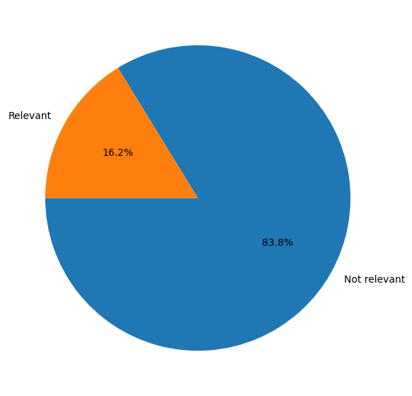
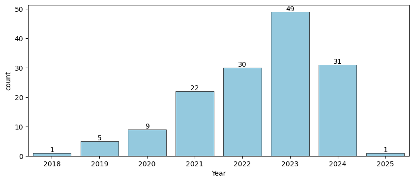
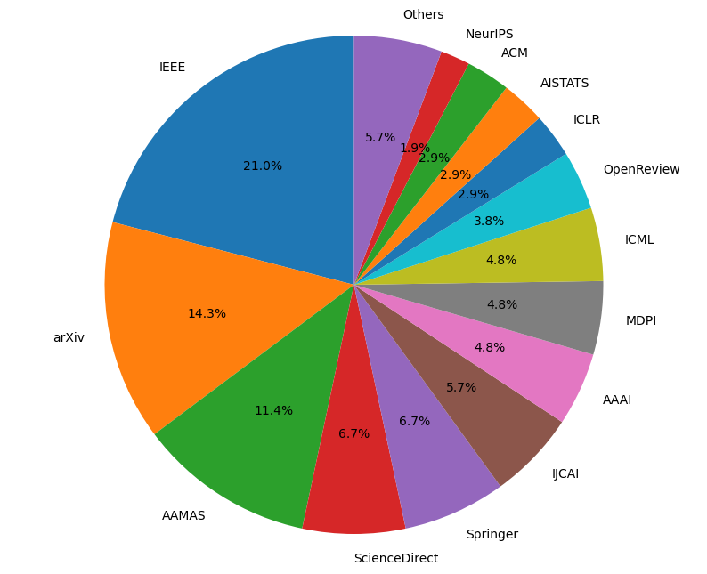
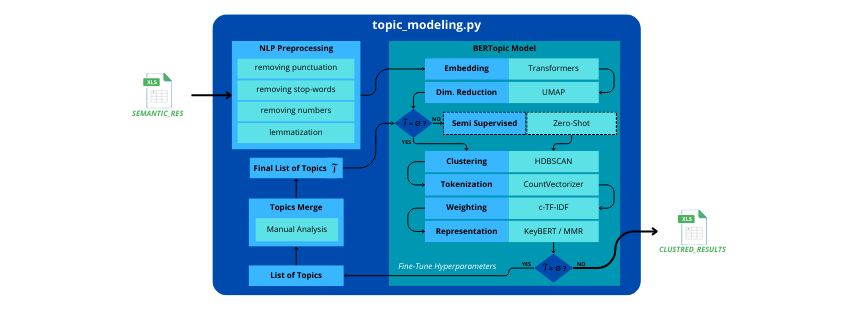
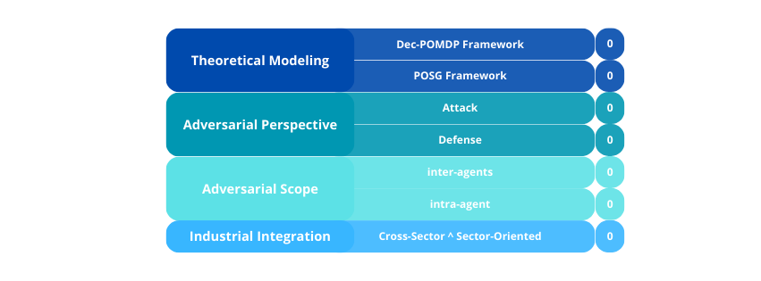

### Methodology

Our methodology for conducting a comprehensive survey on adversarial attacks and defenses in multi-agent reinforcement learning (AMARL) is divided into four main phases: **Data Collection**, **Exploratory Data Analysis**, **Topic Modeling**, and **Papers Classification**. Each phase is designed to ensure a systematic and insightful analysis of the research landscape. Furthermore, this methodology is designed in a way that makes it reproducible and can be adapted to other domains with minimal modifications to enlarge the impact scope of this work.

---

#### 1. Data Collection

To build a robust dataset of research papers relevant to our area of interest (AOI), we developed a customized web scraping tool using Python 3 and its libraries. This tool comprises two primary components: **Scholar Scraper** and **Venues Scraper**; each targeting distinct sources of academic literature. Figure 1 illustrates the high-level architecture of the data collection and processing pipeline starting from web scraping of multiple papers from various sources using lexcial matching, then filtering the lexical results semantically using a large language model (LLM) API to reduce the noise. The final dataset is then used for further analysis and classification that will be developed in the next subsections.

*Figure 1: High-level architecture of the data collection and processing pipeline.*

**a. Scholar Scraper:**  
This component performs targeted searches on Google Scholar search engine using a pre-defined query string *q*. It retrieves the top *K* pages of search results, where *K* is a configurable parameter. Since Google Scholar only provides paper titles and links in its results pages, we implemented a suite of custom abstract scrapers tailored to the specific formats of various academic publishers, namely:
- **IEEE**: Institute of Electrical and Electronics Engineers 
- **Springer Nature**
- **MLR**: Journal of Machine Learning Research
- **ArXiv**: Cornell University's open-access repository
- **NeurIPS**: Conference on Neural Information Processing Systems
- **MDPI**: Multidisciplinary Digital Publishing Institute
- **ScienceDirect**: Elsevier's scientific database
- **ACM**: Association for Computing Machinery
- **AAAI**: Association for the Advancement of Artificial Intelligence
- **JAIR**: Journal of Artificial Intelligence Research
- **JMLR**: Journal of Machine Learning Research
- **IJCAI**: International Joint Conference on Artificial Intelligence

This component was designed to be highly modular and extensible, allowing for easy integration of additional publishers as needed. Furthermore, we made sure to handle the scraping limitations imposed by the publishers, such as rate limiting and CAPTCHAs, by incorporating appropriate delays and error handling mechanisms, except for ScienceDirect, which required manual intervention due to its complex anti-scraping measures. Also, we implemented a parallelized scraping mechanism to speed up the process and reduce the overall runtime up to 10 times compared to a sequential approach.

**b. Venue Scraper:**  
We directly targeted some high-impact conference websites known for their focus on MARL, game theory, and adversarial learning. Using 5 keyword bags (*Reinforcement Learning (RL)*, *Multi-Agent RL (MARL)*, *Game Theory* (GA), and *Adversarial*) containing numerous relevant words to our targeted field, we built a logical combination that helps selecting the most likely papers to be relevant to our AOI through large number of query combinations. The combination structure is as follows:

-  `Adversarial` AND ((`MARL`) OR (`GA`) OR (`RL` AND `MA`))

We extracted papers from the following venues:
- **AAMAS**: International Conference on Autonomous Agents and Multiagent Systems
- **IJCAI**: International Joint Conference on Artificial Intelligence
- **AISTATS**: International Conference on Artificial Intelligence and Statistics
- **ICML**: International Conference on Machine Learning
- **ICLR**: International Conference on Learning Representations

| Parameter       | Scholar Scraper                                                        | Venue Scraper                                                                 |
|-----------------|------------------------------------------------------------------------|-------------------------------------------------------------------------------|
| **K pages**     | 50               | N/A                                                                           |
| **Start-End Years** | N/A                                                                | 01/01/2018 to 07/01/2025                                          |
| **Keyword Bags**| Reinforcement Learning (RL), Multi-Agent RL (MARL), Game Theory (GA), Adversarial                                                                    | Reinforcement Learning (RL), Multi-Agent RL (MARL), Game Theory (GA), Adversarial |
| **Search Query**| `Adversarial` AND ((`MARL`) OR (`GA`) OR (`RL` AND `MA`))                                           | `Adversarial` AND ((`MARL`) OR (`GA`) OR (`RL` AND `MA`))                                                                           |

*Tabel 1: Comparison of key parameters between Scholar Scraper and Venue Scraper.*

Table 1 summarizes the parameters used for the papers collection overall; extra details are available in the appendix. The results from both components were merged into a unified dataset stored in an Excel file, containing five columns: *Title*, *Abstract*, *Year*, *Source*, and *URL*. Through iterative experimentation with different keyword combinations and query strings, we curated a final dataset of **647 papers** deemed highly relevant to our survey based only on lexical matching.

**Semantic Filtering Using Large Language Models:**  
To refine the dataset further, we employed an open-source large language model (LLM), specifically Microsoft's **Phi-3.5** model available on HuggingFace Hub, to perform semantic filtering. This step was crucial to address the limitations of keyword-based searches, which often include papers that are tangentially related or irrelevant. We designed a carefully engineered prompt to evaluate the relevance of each paper based on its title and abstract. After this filtering process, the dataset was reduced to **148 papers** that were directly aligned with the scope of our survey.

---

#### 2. EDA
We conducted an exploratory data analysis (EDA) to gain insights into the distribution of papers across different years and sources. We summarized the key statistics of the dataset, including the number of papers per year, per source, and per source quality cluster, to identify trends and patterns in the research landscape. 

**Efficiency of the Lexicon-based search:**
We evaluated the efficiency of the lexicon-based search after the semantic filtering step by comparing the number of papers marked as relevant by the LLM model to the number of papers that were marked as irrelevant. The results showed that almost 83% of the papers were irrelevant as shown in Figure 2, which highlights the importance of the semantic filtering step in refining the dataset. 

We manually reviewed a sample of the papers marked as irrelevant to identify any potential false negatives and found that the LLM model was effective in capturing the relevant papers.

**Distribution of Papers by Year:**
We visualized the distribution of papers across different years to identify trends and patterns in the research landscape. The results as illustrated in Figure 3 showed a linearly increasing trend in the number of papers published over the years, with a significant decline in 2024. This trend suggests a growing interest in the field of adversarial attacks and defenses in multi-agent reinforcement learning.

**Distribution of Papers by Source:**
We analyzed the distribution of papers across different sources to identify the most prominent venues in the field. The results as illustrated in Figure 4 showed that the majority of the papers were published in the ArXiv repository and IEEE conferences, followed by AAMAS, ICLR, IJCAI and AAAI, which confirms the relevance of these sources to our research area.

%TODO: Add a paragraph about the distribution of papers by quality

**Distribution of Papers by Quality:**
We assessed the quality of the papers in the dataset by analyzing the distribution of papers across different sources. The results as illustrated in Figure 5 showed that the majority of the papers were published in high-quality venues such as ICLR, IJCAI, and AAAI, which indicates the credibility and significance of the dataset.

#### 3. Topic Modeling

##### 2.1.Text Preprocessing:
Before applying the BERTopic modeling pipeline, we performed a comprehensive text preprocessing phase to ensure the quality and consistency of the textual data. This phase included several key steps:

1. **Cleaning:** We removed any non-alphanumeric characters, punctuation, and stop words from the text to eliminate noise and irrelevant information.
2. **Tokenization:** The cleaned text was then tokenized into individual words or tokens, which are the basic units of analysis for subsequent steps.
3. **Lemmatization:** We applied lemmatization to reduce words to their base or root form, ensuring that different forms of a word (e.g., "running" and "ran") are treated as a single token. This step helps in normalizing the text and improving the accuracy of the topic modeling process.

##### 2.2. BERTopic Modeling Pipeline:
To uncover the underlying research trends and themes within the filtered dataset, we applied an advanced clustering pipeline using the **BERTopic** library.

The application of BERTopic modeling has proven effective in analyzing complex research themes across various fields. For instance, in the context of the metaverse, researchers utilized BERTopic to analyze 2,181 publications, revealing 12 primary topics such as education, healthcare, and blockchain. Moreover, BERTopic has been successfully applied to other domains like healthcare and technology, facilitating the exploration of emerging topics and trends.

By leveraging BERTopic, we can identify critical themes, understand the research landscape, and highlight gaps for further investigation in Adversarial Multi-Agent RL.

This pipeline as showen in Figure 5 consisted of seven interconnected modules:

1. **Embedding**: Leveraging transformer-based models, namely SBERT, to generate dense vector representations of the text.
2. **Dimensionality Reduction**: Utilizing UMAP to reduce the dimensionality of the embeddings while preserving their semantic structure.
3. **Semi-Supervised Clustering**: Incorporating a zero-shot learning technique to guide the clustering process.
4. **Clustering**: Applying HDBSCAN to identify natural groupings within the data.
5. **Vecotrization**: Using CountVectorizer to convert the text data into a matrix of token counts.
6. **Weighting**: Employing c-TF-IDF to assign importance scores to terms within each cluster.
7. **Word Representation**: Combining KeyBERT and Maximal Marginal Relevance (MMR) to extract representative keywords for each topic.

_Figure 5: BERTopic modeling pipeline for topic extraction and clustering._

Every paper is represented as a dense vector in the embedding space, which is then projected into a lower-dimensional space using UMAP. The reduced vectors are clustered using HDBSCAN. The clustering results are vectorized using CountVectorizer and weighted using c-TF-IDF. Finally, representative keywords are extracted using KeyBERT and MMR. This operation is repeated iteratively with different combinations of hyperparameters for every component to refine the topics and improve the clustering quality until convergence is reached, i.e., the topics are stable. 

The list of extracted topics is then manually reviewed and refined to ensure coherence and relevance. The list of final topics **𝑇** is then used to classify the papers into distinct themes using the same pipeline with the addition of the zero-shot module.

The final list of topics extracted from the dataset includes Attacks, Defenses, Communication, and Applications. However, 'Applications' was an engineered topic obtained from merging all the industry-oriented topics found, namely: energy, cybersecurity, and vehicles.

#### 4. Papers Classification
We observed that the similarity between the papers in our survey is very high ( < 1), which is attributed to the narrow scope of our research field. Consequently, most papers share a common vocabulary, with only a few less frequent words differentiating them. This posed a challenge in the topic modeling process, prompting us to adopt a soft clustering approach instead of a hard clustering one. This method more accurately captures the overlapping nature of the topics.

_Figure 6: Papers classification vector_

The Figure 6 illustrates our suggested classification for the papers surveyed in this work based on the topics extracted from the BERTopic model. It is mainly a 7-bits vector, where each bit represents a criterion for the classification. The first 2 bits are related to Theoretical Modeling used in the study, which is either a Dec-POMDP, a POSG, or a combination of both. The next 2 bits are related to the Adversarial Perspective of the study, whether it focuses on developing stronger attacks or more robust defenses, or focuses equally on both. The next 2 bits reflects the Adversarial Scope of the study, whether it targets elements proper to every agent itself (e.g., actions, observations, policies) or between 2 or more agents (e.g., communication, interaction), or both. The last bit is related to the Industrial Integration of the study, whether it is applied to a specific industry or not.